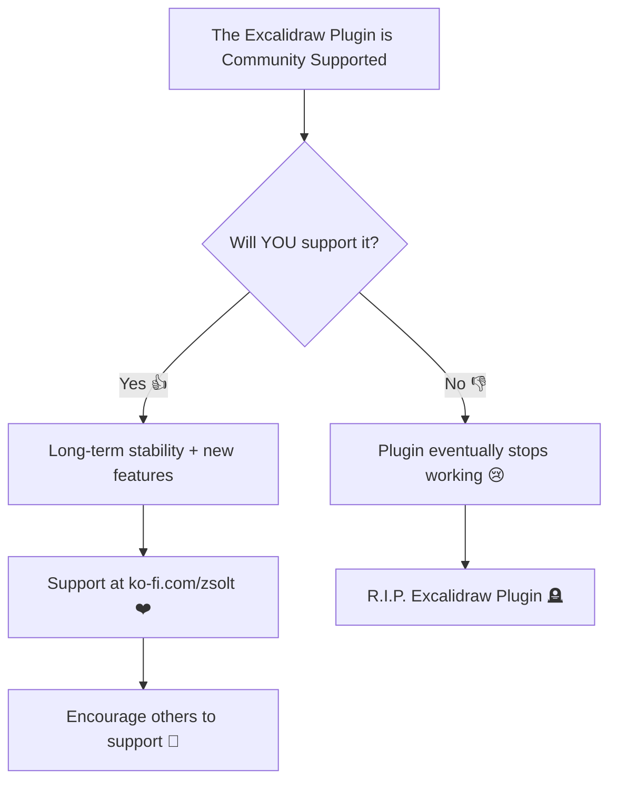

==⚠ Switch to EXCALIDRAW VIEW in the MORE OPTIONS menu of this document. ⚠== You can decompress Drawing data with the command palette: 'Decompress current Excalidraw file'. For more info check in plugin settings under 'Saving'

# Mermaid



# LyraStarterGameClone.cpp

```embed-cpp
PATH: "vault://Source/LyraStarterGameClone/LyraStarterGameClone.cpp"
```

# LyraStarterGameClone.h

```embed-cpp
PATH: "vault://Source/LyraStarterGameClone/LyraStarterGameClone.h"
```
# Excalidraw Data

## Text Elements

The Excalidraw Plugin is Community Supported ^Im5eSmaB

Will YOU support it? ^E2UVPtzj

Long-term stability + new features ^h1AgRvfn

Plugin eventually stops working 😢 ^pEnlxfTr

Support at ❤️ https://ko-fi.com/zsolt ^McKpT36b

🪦 R.I.P. Excalidraw Plugin ^ir6xVKwh

👍 Yes ^Si1194xl

No 👎 ^FwaD4lYy

Code Example ^3nEwuzOv

Diagram Example ^Jxn47caO

Web Embed Example ^brUJSTqq

Sketch Example ^I7uOuZqd

Mermaid Example ^Mwp9LPsL

## Element Links
CMZFKOhy: [[Docs/Example.excalidraw#LyraStarterGameClone.cpp]]

lEucns8K: [[Docs/Example.excalidraw#LyraStarterGameClone.h]]

L53V5qeu: https://www.unrealengine.com/ko

acmDiG81: [[Docs/Example.excalidraw#Mermaid]]

%%
## Drawing
```json
{
	"type": "excalidraw",
	"version": 2,
	"source": "https://github.com/zsviczian/obsidian-excalidraw-plugin/releases/tag/2.12.4",
	"elements": [
		{
			"id": "CMZFKOhy",
			"type": "embeddable",
			"x": -1884.3698039362962,
			"y": -1519.995816659719,
			"width": 761.0821620937617,
			"height": 754.9847052734933,
			"angle": 0,
			"strokeColor": "#000000",
			"backgroundColor": "transparent",
			"fillStyle": "hachure",
			"strokeWidth": 1,
			"strokeStyle": "solid",
			"roughness": 1,
			"opacity": 100,
			"roundness": null,
			"seed": 26618,
			"version": 930,
			"versionNonce": 1483202346,
			"updated": 1757596372850,
			"isDeleted": false,
			"groupIds": [],
			"boundElements": [
				{
					"id": "0qUd1GDX3FWDwCOQee7Q7",
					"type": "arrow"
				}
			],
			"link": "[[Docs/example.excalidraw#LyraStarterGameClone.cpp]]",
			"locked": false,
			"scale": [
				1,
				1
			],
			"customData": {
				"mdProps": {
					"useObsidianDefaults": false,
					"backgroundMatchCanvas": true,
					"backgroundMatchElement": false,
					"backgroundColor": "#fff",
					"backgroundOpacity": 0,
					"borderMatchElement": true,
					"borderColor": "#fff",
					"borderOpacity": 0,
					"filenameVisible": false
				}
			},
			"index": "a2",
			"frameId": "8TK1GnFAGdeMnESJX8qXd"
		},
		{
			"id": "lEucns8K",
			"type": "embeddable",
			"x": -1877.3871678656337,
			"y": -2024.6779739750573,
			"width": 749.1105088286125,
			"height": 264.07451890158455,
			"angle": 0,
			"strokeColor": "#000000",
			"backgroundColor": "transparent",
			"fillStyle": "hachure",
			"strokeWidth": 1,
			"strokeStyle": "solid",
			"roughness": 1,
			"opacity": 100,
			"roundness": null,
			"seed": 67358,
			"version": 739,
			"versionNonce": 703103094,
			"updated": 1757596372850,
			"isDeleted": false,
			"groupIds": [],
			"boundElements": [
				{
					"id": "0qUd1GDX3FWDwCOQee7Q7",
					"type": "arrow"
				}
			],
			"link": "[[Docs/example.excalidraw#LyraStarterGameClone.h]]",
			"locked": false,
			"scale": [
				1,
				1
			],
			"customData": {
				"mdProps": {
					"useObsidianDefaults": false,
					"backgroundMatchCanvas": true,
					"backgroundMatchElement": false,
					"backgroundColor": "#fff",
					"backgroundOpacity": 0,
					"borderMatchElement": true,
					"borderColor": "#fff",
					"borderOpacity": 0,
					"filenameVisible": false
				}
			},
			"index": "a3",
			"frameId": "8TK1GnFAGdeMnESJX8qXd"
		},
		{
			"id": "0qUd1GDX3FWDwCOQee7Q7",
			"type": "arrow",
			"x": -1516.591351953811,
			"y": -1742.8674622700248,
			"width": 1.8394791766506842,
			"height": 203.29386975163015,
			"angle": 0,
			"strokeColor": "#1e1e1e",
			"backgroundColor": "transparent",
			"fillStyle": "solid",
			"strokeWidth": 2,
			"strokeStyle": "solid",
			"roughness": 1,
			"opacity": 100,
			"groupIds": [],
			"frameId": "8TK1GnFAGdeMnESJX8qXd",
			"index": "a6",
			"roundness": {
				"type": 2
			},
			"seed": 647593739,
			"version": 757,
			"versionNonce": 657877482,
			"isDeleted": false,
			"boundElements": [],
			"updated": 1757596372850,
			"link": null,
			"locked": false,
			"points": [
				[
					0,
					0
				],
				[
					-1.8394791766506842,
					203.29386975163015
				]
			],
			"lastCommittedPoint": null,
			"startBinding": {
				"elementId": "lEucns8K",
				"focus": 0.03408227542507555,
				"gap": 17.735992803448312
			},
			"endBinding": {
				"elementId": "CMZFKOhy",
				"focus": -0.048776488693484964,
				"gap": 19.577775858675523
			},
			"startArrowhead": null,
			"endArrowhead": "arrow",
			"elbowed": false
		},
		{
			"id": "qWQHU2PPDGIC-DHeYzn0v",
			"type": "rectangle",
			"x": -707.3495424833432,
			"y": -823.1207051485828,
			"width": 550.3847424890262,
			"height": 56.98551462029627,
			"angle": 0,
			"strokeColor": "#1e1e1e",
			"backgroundColor": "transparent",
			"fillStyle": "solid",
			"strokeWidth": 2,
			"strokeStyle": "solid",
			"roughness": 0,
			"opacity": 100,
			"groupIds": [],
			"frameId": "8TK1GnFAGdeMnESJX8qXd",
			"index": "aD",
			"roundness": {
				"type": 3
			},
			"seed": 109293290,
			"version": 557,
			"versionNonce": 1563230646,
			"isDeleted": false,
			"boundElements": [],
			"updated": 1757596372850,
			"link": null,
			"locked": false
		},
		{
			"id": "idUakRKCavT-zdtzz-3Td",
			"type": "rectangle",
			"x": -395.51191090094517,
			"y": -1005.4743128046671,
			"width": 59.834813176480566,
			"height": 178.07975764396406,
			"angle": 0,
			"strokeColor": "#1971c2",
			"backgroundColor": "#a5d8ff",
			"fillStyle": "solid",
			"strokeWidth": 2,
			"strokeStyle": "solid",
			"roughness": 0,
			"opacity": 100,
			"groupIds": [],
			"frameId": "8TK1GnFAGdeMnESJX8qXd",
			"index": "aJ",
			"roundness": {
				"type": 3
			},
			"seed": 146948522,
			"version": 554,
			"versionNonce": 426089642,
			"isDeleted": false,
			"boundElements": [],
			"updated": 1757596372850,
			"link": null,
			"locked": false
		},
		{
			"id": "XOuTKlgaIt-ZJe7u-XzJR",
			"type": "arrow",
			"x": -478.14085166781933,
			"y": -991.4577250128955,
			"width": 233.65420415128898,
			"height": 100.69170113127473,
			"angle": 0,
			"strokeColor": "#1971c2",
			"backgroundColor": "#a5d8ff",
			"fillStyle": "solid",
			"strokeWidth": 2,
			"strokeStyle": "dashed",
			"roughness": 0,
			"opacity": 100,
			"groupIds": [],
			"frameId": "8TK1GnFAGdeMnESJX8qXd",
			"index": "aK",
			"roundness": {
				"type": 2
			},
			"seed": 1394637930,
			"version": 952,
			"versionNonce": 1322212086,
			"isDeleted": false,
			"boundElements": [],
			"updated": 1757596372850,
			"link": null,
			"locked": false,
			"points": [
				[
					0,
					0
				],
				[
					134.87288501543458,
					-97.61275844502256
				],
				[
					233.65420415128898,
					3.0789426862521623
				]
			],
			"lastCommittedPoint": null,
			"startBinding": null,
			"endBinding": null,
			"startArrowhead": null,
			"endArrowhead": "arrow",
			"elbowed": false
		},
		{
			"id": "wQLbNfpyMsNPmLYjsdpMm",
			"type": "ellipse",
			"x": -572.1669866594316,
			"y": -1006.8989946901454,
			"width": 55.56089794958916,
			"height": 58.4101312910027,
			"angle": 0,
			"strokeColor": "#2f9e44",
			"backgroundColor": "#b2f2bb",
			"fillStyle": "solid",
			"strokeWidth": 2,
			"strokeStyle": "solid",
			"roughness": 0,
			"opacity": 100,
			"groupIds": [],
			"frameId": "8TK1GnFAGdeMnESJX8qXd",
			"index": "aL",
			"roundness": {
				"type": 2
			},
			"seed": 325672746,
			"version": 468,
			"versionNonce": 1285584746,
			"isDeleted": false,
			"boundElements": [],
			"updated": 1757596372850,
			"link": null,
			"locked": false
		},
		{
			"id": "w0aERg7iUcJYLWBPr8sq9",
			"type": "line",
			"x": -546.5234952980827,
			"y": -945.6396300577289,
			"width": 1.424812315019608,
			"height": 71.23187697167737,
			"angle": 0,
			"strokeColor": "#2f9e44",
			"backgroundColor": "#b2f2bb",
			"fillStyle": "solid",
			"strokeWidth": 2,
			"strokeStyle": "solid",
			"roughness": 0,
			"opacity": 100,
			"groupIds": [],
			"frameId": "8TK1GnFAGdeMnESJX8qXd",
			"index": "aM",
			"roundness": {
				"type": 2
			},
			"seed": 101181930,
			"version": 447,
			"versionNonce": 626297910,
			"isDeleted": false,
			"boundElements": [],
			"updated": 1757596372850,
			"link": null,
			"locked": false,
			"points": [
				[
					0,
					0
				],
				[
					-1.424812315019608,
					71.23187697167737
				]
			],
			"lastCommittedPoint": null,
			"startBinding": null,
			"endBinding": null,
			"startArrowhead": null,
			"endArrowhead": null,
			"polygon": false
		},
		{
			"id": "e6JDbqlnxtdE7V_DJD0i_",
			"type": "line",
			"x": -584.9887323401058,
			"y": -917.1469053549665,
			"width": 72.65655885715478,
			"height": 1.4246818854778667,
			"angle": 0,
			"strokeColor": "#2f9e44",
			"backgroundColor": "#b2f2bb",
			"fillStyle": "solid",
			"strokeWidth": 2,
			"strokeStyle": "solid",
			"roughness": 0,
			"opacity": 100,
			"groupIds": [],
			"frameId": "8TK1GnFAGdeMnESJX8qXd",
			"index": "aN",
			"roundness": {
				"type": 2
			},
			"seed": 570891434,
			"version": 441,
			"versionNonce": 1899100714,
			"isDeleted": false,
			"boundElements": [],
			"updated": 1757596372850,
			"link": null,
			"locked": false,
			"points": [
				[
					0,
					0
				],
				[
					72.65655885715478,
					1.4246818854778667
				]
			],
			"lastCommittedPoint": null,
			"startBinding": null,
			"endBinding": null,
			"startArrowhead": null,
			"endArrowhead": null,
			"polygon": false
		},
		{
			"id": "41HDazVgIXEm0Rpu3SOOC",
			"type": "line",
			"x": -547.9483076131023,
			"y": -875.8323045419875,
			"width": 14.246297136610565,
			"height": 41.31447038343708,
			"angle": 0,
			"strokeColor": "#2f9e44",
			"backgroundColor": "#b2f2bb",
			"fillStyle": "solid",
			"strokeWidth": 2,
			"strokeStyle": "solid",
			"roughness": 0,
			"opacity": 100,
			"groupIds": [],
			"frameId": "8TK1GnFAGdeMnESJX8qXd",
			"index": "aO",
			"roundness": {
				"type": 2
			},
			"seed": 1158805354,
			"version": 443,
			"versionNonce": 1856083318,
			"isDeleted": false,
			"boundElements": [],
			"updated": 1757596372850,
			"link": null,
			"locked": false,
			"points": [
				[
					0,
					0
				],
				[
					-14.246297136610565,
					41.31447038343708
				]
			],
			"lastCommittedPoint": null,
			"startBinding": null,
			"endBinding": null,
			"startArrowhead": null,
			"endArrowhead": null,
			"polygon": false
		},
		{
			"id": "t68TDnUTJ1StRxLk6fUdO",
			"type": "line",
			"x": -546.1329422286163,
			"y": -875.1851644687779,
			"width": 25.64349136134865,
			"height": 37.04055515654545,
			"angle": 0,
			"strokeColor": "#2f9e44",
			"backgroundColor": "#b2f2bb",
			"fillStyle": "solid",
			"strokeWidth": 2,
			"strokeStyle": "solid",
			"roughness": 0,
			"opacity": 100,
			"groupIds": [],
			"frameId": "8TK1GnFAGdeMnESJX8qXd",
			"index": "aP",
			"roundness": {
				"type": 2
			},
			"seed": 1601403434,
			"version": 468,
			"versionNonce": 1980048618,
			"isDeleted": false,
			"boundElements": [],
			"updated": 1757596372850,
			"link": null,
			"locked": false,
			"points": [
				[
					0,
					0
				],
				[
					25.64349136134865,
					37.04055515654545
				]
			],
			"lastCommittedPoint": null,
			"startBinding": null,
			"endBinding": null,
			"startArrowhead": null,
			"endArrowhead": null,
			"polygon": false
		},
		{
			"id": "MczxpFequcEfV7fSKnwd6",
			"type": "rectangle",
			"x": -702.992760882132,
			"y": -2000.5563689813048,
			"width": 542.0521240234375,
			"height": 56,
			"angle": 0,
			"strokeColor": "#1e1e1e",
			"backgroundColor": "transparent",
			"fillStyle": "solid",
			"strokeWidth": 2,
			"strokeStyle": "solid",
			"roughness": 0,
			"opacity": 100,
			"groupIds": [],
			"frameId": "8TK1GnFAGdeMnESJX8qXd",
			"index": "aU",
			"roundness": null,
			"seed": 1777389558,
			"version": 296,
			"versionNonce": 872117942,
			"isDeleted": false,
			"boundElements": [
				{
					"type": "text",
					"id": "Im5eSmaB"
				},
				{
					"id": "5oYEpdBXgTaowRt-zfFT7",
					"type": "arrow"
				}
			],
			"updated": 1757596372850,
			"link": null,
			"locked": false
		},
		{
			"id": "Im5eSmaB",
			"type": "text",
			"x": -632.7665188167023,
			"y": -1995.5563689813048,
			"width": 401.5996398925781,
			"height": 46,
			"angle": 0,
			"strokeColor": "#1e1e1e",
			"backgroundColor": "transparent",
			"fillStyle": "solid",
			"strokeWidth": 2,
			"strokeStyle": "solid",
			"roughness": 1,
			"opacity": 100,
			"groupIds": [],
			"frameId": "8TK1GnFAGdeMnESJX8qXd",
			"index": "aV",
			"roundness": null,
			"seed": 417741494,
			"version": 345,
			"versionNonce": 883226538,
			"isDeleted": false,
			"boundElements": [],
			"updated": 1757596372850,
			"link": null,
			"locked": false,
			"text": "\nThe Excalidraw Plugin is Community Supported",
			"rawText": "\nThe Excalidraw Plugin is Community Supported",
			"fontSize": 20,
			"fontFamily": 7,
			"textAlign": "center",
			"verticalAlign": "middle",
			"containerId": "MczxpFequcEfV7fSKnwd6",
			"originalText": "\nThe Excalidraw Plugin is Community Supported",
			"autoResize": true,
			"lineHeight": 1.15
		},
		{
			"id": "3l970Y-dlKE6ORH9pGDJN",
			"type": "diamond",
			"x": -574.815659746878,
			"y": -1903.0563766106993,
			"width": 285.69793701171875,
			"height": 285.69793701171875,
			"angle": 0,
			"strokeColor": "#1e1e1e",
			"backgroundColor": "transparent",
			"fillStyle": "solid",
			"strokeWidth": 2,
			"strokeStyle": "solid",
			"roughness": 0,
			"opacity": 100,
			"groupIds": [],
			"frameId": "8TK1GnFAGdeMnESJX8qXd",
			"index": "aW",
			"roundness": null,
			"seed": 645882166,
			"version": 301,
			"versionNonce": 235352054,
			"isDeleted": false,
			"boundElements": [
				{
					"type": "text",
					"id": "E2UVPtzj"
				},
				{
					"id": "5oYEpdBXgTaowRt-zfFT7",
					"type": "arrow"
				},
				{
					"id": "sRKWVnybSzjThcRCCNQ62",
					"type": "arrow"
				},
				{
					"id": "as7W8OLu5rax41gdk6x9x",
					"type": "arrow"
				}
			],
			"updated": 1757596372850,
			"link": null,
			"locked": false
		},
		{
			"id": "E2UVPtzj",
			"type": "text",
			"x": -479.83113215898743,
			"y": -1783.1318923577696,
			"width": 95.87991333007812,
			"height": 46,
			"angle": 0,
			"strokeColor": "#1e1e1e",
			"backgroundColor": "transparent",
			"fillStyle": "solid",
			"strokeWidth": 2,
			"strokeStyle": "solid",
			"roughness": 1,
			"opacity": 100,
			"groupIds": [],
			"frameId": "8TK1GnFAGdeMnESJX8qXd",
			"index": "aX",
			"roundness": null,
			"seed": 752059702,
			"version": 344,
			"versionNonce": 490500714,
			"isDeleted": false,
			"boundElements": [],
			"updated": 1757596372850,
			"link": null,
			"locked": false,
			"text": "Will YOU\nsupport it?",
			"rawText": "Will YOU support it?",
			"fontSize": 20,
			"fontFamily": 7,
			"textAlign": "center",
			"verticalAlign": "middle",
			"containerId": "3l970Y-dlKE6ORH9pGDJN",
			"originalText": "Will YOU support it?",
			"autoResize": true,
			"lineHeight": 1.15
		},
		{
			"id": "-ZvzlxBk-57grvF7yPhhd",
			"type": "rectangle",
			"x": -862.1698314998077,
			"y": -1534.858431969586,
			"width": 403.6354064941406,
			"height": 47.5,
			"angle": 0,
			"strokeColor": "#1e1e1e",
			"backgroundColor": "transparent",
			"fillStyle": "solid",
			"strokeWidth": 2,
			"strokeStyle": "solid",
			"roughness": 0,
			"opacity": 100,
			"groupIds": [],
			"frameId": "8TK1GnFAGdeMnESJX8qXd",
			"index": "aY",
			"roundness": null,
			"seed": 229231222,
			"version": 298,
			"versionNonce": 952746294,
			"isDeleted": false,
			"boundElements": [
				{
					"type": "text",
					"id": "h1AgRvfn"
				},
				{
					"id": "sRKWVnybSzjThcRCCNQ62",
					"type": "arrow"
				},
				{
					"id": "snC5ftn7L4YS8f0RUVLoJ",
					"type": "arrow"
				}
			],
			"updated": 1757596372850,
			"link": null,
			"locked": false
		},
		{
			"id": "h1AgRvfn",
			"type": "text",
			"x": -809.311997637503,
			"y": -1522.608431969586,
			"width": 297.91973876953125,
			"height": 23,
			"angle": 0,
			"strokeColor": "#1e1e1e",
			"backgroundColor": "transparent",
			"fillStyle": "solid",
			"strokeWidth": 2,
			"strokeStyle": "solid",
			"roughness": 1,
			"opacity": 100,
			"groupIds": [],
			"frameId": "8TK1GnFAGdeMnESJX8qXd",
			"index": "aZ",
			"roundness": null,
			"seed": 550514614,
			"version": 344,
			"versionNonce": 1654035754,
			"isDeleted": false,
			"boundElements": [],
			"updated": 1757596372850,
			"link": null,
			"locked": false,
			"text": "Long-term stability + new features",
			"rawText": "Long-term stability + new features",
			"fontSize": 20,
			"fontFamily": 7,
			"textAlign": "center",
			"verticalAlign": "middle",
			"containerId": "-ZvzlxBk-57grvF7yPhhd",
			"originalText": "Long-term stability + new features",
			"autoResize": true,
			"lineHeight": 1.15
		},
		{
			"id": "uOqetKlNG6OqEB-VHqOpA",
			"type": "rectangle",
			"x": -408.53440974687805,
			"y": -1534.858431969586,
			"width": 409.90625,
			"height": 47.5,
			"angle": 0,
			"strokeColor": "#1e1e1e",
			"backgroundColor": "transparent",
			"fillStyle": "solid",
			"strokeWidth": 2,
			"strokeStyle": "solid",
			"roughness": 0,
			"opacity": 100,
			"groupIds": [],
			"frameId": "8TK1GnFAGdeMnESJX8qXd",
			"index": "aa",
			"roundness": null,
			"seed": 238357430,
			"version": 298,
			"versionNonce": 665332342,
			"isDeleted": false,
			"boundElements": [
				{
					"type": "text",
					"id": "pEnlxfTr"
				},
				{
					"id": "as7W8OLu5rax41gdk6x9x",
					"type": "arrow"
				},
				{
					"id": "be0l76Hs14yyCcBsNE1iy",
					"type": "arrow"
				}
			],
			"updated": 1757596372850,
			"link": null,
			"locked": false
		},
		{
			"id": "pEnlxfTr",
			"type": "text",
			"x": -356.31163142656555,
			"y": -1522.608431969586,
			"width": 305.460693359375,
			"height": 23,
			"angle": 0,
			"strokeColor": "#1e1e1e",
			"backgroundColor": "transparent",
			"fillStyle": "solid",
			"strokeWidth": 2,
			"strokeStyle": "solid",
			"roughness": 1,
			"opacity": 100,
			"groupIds": [],
			"frameId": "8TK1GnFAGdeMnESJX8qXd",
			"index": "ab",
			"roundness": null,
			"seed": 8665654,
			"version": 344,
			"versionNonce": 639524842,
			"isDeleted": false,
			"boundElements": [],
			"updated": 1757596372850,
			"link": null,
			"locked": false,
			"text": "Plugin eventually stops working 😢",
			"rawText": "Plugin eventually stops working 😢",
			"fontSize": 20,
			"fontFamily": 7,
			"textAlign": "center",
			"verticalAlign": "middle",
			"containerId": "uOqetKlNG6OqEB-VHqOpA",
			"originalText": "Plugin eventually stops working 😢",
			"autoResize": true,
			"lineHeight": 1.15
		},
		{
			"id": "TGx1n03x9tJ2j7YHPQdI5",
			"type": "rectangle",
			"x": -884.143784746878,
			"y": -1437.358431969586,
			"width": 447.5833435058594,
			"height": 47.5,
			"angle": 0,
			"strokeColor": "#1e1e1e",
			"backgroundColor": "transparent",
			"fillStyle": "solid",
			"strokeWidth": 2,
			"strokeStyle": "solid",
			"roughness": 0,
			"opacity": 100,
			"groupIds": [],
			"frameId": "8TK1GnFAGdeMnESJX8qXd",
			"index": "ac",
			"roundness": null,
			"seed": 1984308470,
			"version": 297,
			"versionNonce": 426208182,
			"isDeleted": false,
			"boundElements": [
				{
					"type": "text",
					"id": "McKpT36b"
				},
				{
					"id": "snC5ftn7L4YS8f0RUVLoJ",
					"type": "arrow"
				}
			],
			"updated": 1757596372850,
			"link": null,
			"locked": false
		},
		{
			"id": "McKpT36b",
			"type": "text",
			"x": -827.6024486873077,
			"y": -1425.108431969586,
			"width": 334.50067138671875,
			"height": 23,
			"angle": 0,
			"strokeColor": "#1e1e1e",
			"backgroundColor": "transparent",
			"fillStyle": "solid",
			"strokeWidth": 2,
			"strokeStyle": "solid",
			"roughness": 1,
			"opacity": 100,
			"groupIds": [],
			"frameId": "8TK1GnFAGdeMnESJX8qXd",
			"index": "ad",
			"roundness": null,
			"seed": 228041910,
			"version": 344,
			"versionNonce": 601805482,
			"isDeleted": false,
			"boundElements": [],
			"updated": 1757596372850,
			"link": null,
			"locked": false,
			"text": "Support at ❤️ https://ko-fi.com/zsolt",
			"rawText": "Support at ❤️ https://ko-fi.com/zsolt",
			"fontSize": 20,
			"fontFamily": 7,
			"textAlign": "center",
			"verticalAlign": "middle",
			"containerId": "TGx1n03x9tJ2j7YHPQdI5",
			"originalText": "Support at ❤️ https://ko-fi.com/zsolt",
			"autoResize": true,
			"lineHeight": 1.15
		},
		{
			"id": "ENxhRRzZeXa3neh8z8nwx",
			"type": "rectangle",
			"x": -363.40940974687805,
			"y": -1437.358431969586,
			"width": 319.65625,
			"height": 47.5,
			"angle": 0,
			"strokeColor": "#1e1e1e",
			"backgroundColor": "transparent",
			"fillStyle": "solid",
			"strokeWidth": 2,
			"strokeStyle": "solid",
			"roughness": 0,
			"opacity": 100,
			"groupIds": [],
			"frameId": "8TK1GnFAGdeMnESJX8qXd",
			"index": "ag",
			"roundness": null,
			"seed": 123868726,
			"version": 295,
			"versionNonce": 741115126,
			"isDeleted": false,
			"boundElements": [
				{
					"type": "text",
					"id": "ir6xVKwh"
				},
				{
					"id": "be0l76Hs14yyCcBsNE1iy",
					"type": "arrow"
				}
			],
			"updated": 1757596372850,
			"link": null,
			"locked": false
		},
		{
			"id": "ir6xVKwh",
			"type": "text",
			"x": -320.63164638017884,
			"y": -1425.108431969586,
			"width": 234.10072326660156,
			"height": 23,
			"angle": 0,
			"strokeColor": "#1e1e1e",
			"backgroundColor": "transparent",
			"fillStyle": "solid",
			"strokeWidth": 2,
			"strokeStyle": "solid",
			"roughness": 1,
			"opacity": 100,
			"groupIds": [],
			"frameId": "8TK1GnFAGdeMnESJX8qXd",
			"index": "ah",
			"roundness": null,
			"seed": 1149016502,
			"version": 344,
			"versionNonce": 1585638762,
			"isDeleted": false,
			"boundElements": [],
			"updated": 1757596372850,
			"link": null,
			"locked": false,
			"text": "🪦 R.I.P. Excalidraw Plugin",
			"rawText": "🪦 R.I.P. Excalidraw Plugin",
			"fontSize": 20,
			"fontFamily": 7,
			"textAlign": "center",
			"verticalAlign": "middle",
			"containerId": "ENxhRRzZeXa3neh8z8nwx",
			"originalText": "🪦 R.I.P. Excalidraw Plugin",
			"autoResize": true,
			"lineHeight": 1.15
		},
		{
			"id": "5oYEpdBXgTaowRt-zfFT7",
			"type": "arrow",
			"x": -432.06669887041323,
			"y": -1938.6616321391996,
			"width": 0.000021816354660586512,
			"height": 30.968521877276544,
			"angle": 0,
			"strokeColor": "#1e1e1e",
			"backgroundColor": "transparent",
			"fillStyle": "solid",
			"strokeWidth": 2,
			"strokeStyle": "solid",
			"roughness": 0,
			"opacity": 100,
			"groupIds": [],
			"frameId": "8TK1GnFAGdeMnESJX8qXd",
			"index": "ai",
			"roundness": null,
			"seed": 174972790,
			"version": 859,
			"versionNonce": 1903982134,
			"isDeleted": false,
			"boundElements": [],
			"updated": 1757596372850,
			"link": null,
			"locked": false,
			"points": [
				[
					0,
					0
				],
				[
					0.000021816354660586512,
					30.968521877276544
				]
			],
			"lastCommittedPoint": null,
			"startBinding": {
				"elementId": "MczxpFequcEfV7fSKnwd6",
				"focus": -0.00366398774685879,
				"gap": 1,
				"fixedPoint": [
					0.49981551589677803,
					1.105263157894737
				]
			},
			"endBinding": {
				"elementId": "3l970Y-dlKE6ORH9pGDJN",
				"focus": -0.006203302157837409,
				"gap": 5.6615090029063735,
				"fixedPoint": [
					0.4996500296288951,
					-0.016229496438518322
				]
			},
			"startArrowhead": null,
			"endArrowhead": "arrow",
			"elbowed": true,
			"fixedSegments": null,
			"startIsSpecial": null,
			"endIsSpecial": null
		},
		{
			"id": "sRKWVnybSzjThcRCCNQ62",
			"type": "arrow",
			"x": -505.45924304350046,
			"y": -1683.7829238519103,
			"width": 154.9928852092371,
			"height": 143.924491882324,
			"angle": 0,
			"strokeColor": "#1e1e1e",
			"backgroundColor": "transparent",
			"fillStyle": "solid",
			"strokeWidth": 2,
			"strokeStyle": "solid",
			"roughness": 0,
			"opacity": 100,
			"groupIds": [],
			"frameId": "8TK1GnFAGdeMnESJX8qXd",
			"index": "aj",
			"roundness": null,
			"seed": 1672380598,
			"version": 859,
			"versionNonce": 1263906858,
			"isDeleted": false,
			"boundElements": [
				{
					"type": "text",
					"id": "Si1194xl"
				}
			],
			"updated": 1757596372850,
			"link": null,
			"locked": false,
			"points": [
				[
					0,
					0
				],
				[
					-154.9928852092371,
					0
				],
				[
					-154.9928852092371,
					143.924491882324
				]
			],
			"lastCommittedPoint": null,
			"startBinding": {
				"elementId": "3l970Y-dlKE6ORH9pGDJN",
				"focus": -0.014973668291171976,
				"gap": 1,
				"fixedPoint": [
					0.24276134937765662,
					0.7675010014153336
				]
			},
			"endBinding": {
				"elementId": "-ZvzlxBk-57grvF7yPhhd",
				"focus": -0.000001702060098938092,
				"gap": 5.799937011718384,
				"fixedPoint": [
					0.4997522516647667,
					-0.10526315789474162
				]
			},
			"startArrowhead": null,
			"endArrowhead": "arrow",
			"elbowed": true,
			"fixedSegments": null,
			"startIsSpecial": null,
			"endIsSpecial": null
		},
		{
			"id": "Si1194xl",
			"type": "text",
			"x": -691.172579607718,
			"y": -1695.2829238519103,
			"width": 61.44090270996094,
			"height": 23,
			"angle": 0,
			"strokeColor": "#1e1e1e",
			"backgroundColor": "transparent",
			"fillStyle": "solid",
			"strokeWidth": 2,
			"strokeStyle": "solid",
			"roughness": 1,
			"opacity": 100,
			"groupIds": [],
			"frameId": "8TK1GnFAGdeMnESJX8qXd",
			"index": "ak",
			"roundness": null,
			"seed": 2079862134,
			"version": 86,
			"versionNonce": 37502838,
			"isDeleted": false,
			"boundElements": [],
			"updated": 1757596372850,
			"link": null,
			"locked": false,
			"text": "👍 Yes",
			"rawText": "👍 Yes",
			"fontSize": 20,
			"fontFamily": 7,
			"textAlign": "center",
			"verticalAlign": "middle",
			"containerId": "sRKWVnybSzjThcRCCNQ62",
			"originalText": "👍 Yes",
			"autoResize": true,
			"lineHeight": 1.15
		},
		{
			"id": "as7W8OLu5rax41gdk6x9x",
			"type": "arrow",
			"x": -358.32010768208306,
			"y": -1683.7829238519105,
			"width": 154.63882293520504,
			"height": 143.92449188232422,
			"angle": 0,
			"strokeColor": "#1e1e1e",
			"backgroundColor": "transparent",
			"fillStyle": "solid",
			"strokeWidth": 2,
			"strokeStyle": "solid",
			"roughness": 0,
			"opacity": 100,
			"groupIds": [],
			"frameId": "8TK1GnFAGdeMnESJX8qXd",
			"index": "al",
			"roundness": null,
			"seed": 650705398,
			"version": 859,
			"versionNonce": 2118261482,
			"isDeleted": false,
			"boundElements": [
				{
					"type": "text",
					"id": "FwaD4lYy"
				}
			],
			"updated": 1757596372850,
			"link": null,
			"locked": false,
			"points": [
				[
					0,
					0
				],
				[
					154.63882293520504,
					0
				],
				[
					154.63882293520504,
					143.92449188232422
				]
			],
			"lastCommittedPoint": null,
			"startBinding": {
				"elementId": "3l970Y-dlKE6ORH9pGDJN",
				"focus": 0.006416822430461762,
				"gap": 1,
				"fixedPoint": [
					0.7577777926198843,
					0.7675010014153328
				]
			},
			"endBinding": {
				"elementId": "uOqetKlNG6OqEB-VHqOpA",
				"focus": -0.000002439582221379447,
				"gap": 5.799937011718612,
				"fixedPoint": [
					0.4997560417778456,
					-0.10526315789474162
				]
			},
			"startArrowhead": null,
			"endArrowhead": "arrow",
			"elbowed": true,
			"fixedSegments": null,
			"startIsSpecial": null,
			"endIsSpecial": null
		},
		{
			"id": "FwaD4lYy",
			"type": "text",
			"x": -230.90174373125302,
			"y": -1695.2829238519105,
			"width": 54.44091796875,
			"height": 23,
			"angle": 0,
			"strokeColor": "#1e1e1e",
			"backgroundColor": "transparent",
			"fillStyle": "solid",
			"strokeWidth": 2,
			"strokeStyle": "solid",
			"roughness": 1,
			"opacity": 100,
			"groupIds": [],
			"frameId": "8TK1GnFAGdeMnESJX8qXd",
			"index": "am",
			"roundness": null,
			"seed": 2023213046,
			"version": 86,
			"versionNonce": 313581750,
			"isDeleted": false,
			"boundElements": [],
			"updated": 1757596372850,
			"link": null,
			"locked": false,
			"text": "No 👎",
			"rawText": "No 👎",
			"fontSize": 20,
			"fontFamily": 7,
			"textAlign": "center",
			"verticalAlign": "middle",
			"containerId": "as7W8OLu5rax41gdk6x9x",
			"originalText": "No 👎",
			"autoResize": true,
			"lineHeight": 1.15
		},
		{
			"id": "snC5ftn7L4YS8f0RUVLoJ",
			"type": "arrow",
			"x": -660.4521282527376,
			"y": -1482.3584319695863,
			"width": 0.000015258789176186838,
			"height": 40.00000000000023,
			"angle": 0,
			"strokeColor": "#1e1e1e",
			"backgroundColor": "transparent",
			"fillStyle": "solid",
			"strokeWidth": 2,
			"strokeStyle": "solid",
			"roughness": 0,
			"opacity": 100,
			"groupIds": [],
			"frameId": "8TK1GnFAGdeMnESJX8qXd",
			"index": "an",
			"roundness": null,
			"seed": 717376310,
			"version": 858,
			"versionNonce": 1439903146,
			"isDeleted": false,
			"boundElements": [],
			"updated": 1757596372850,
			"link": null,
			"locked": false,
			"points": [
				[
					0,
					0
				],
				[
					0.000015258789176186838,
					40.00000000000023
				]
			],
			"lastCommittedPoint": null,
			"startBinding": {
				"elementId": "-ZvzlxBk-57grvF7yPhhd",
				"focus": -0.000001093867692327971,
				"gap": 1.0000000000002274,
				"fixedPoint": [
					0.4997522516647667,
					1.105263157894732
				]
			},
			"endBinding": {
				"elementId": "TGx1n03x9tJ2j7YHPQdI5",
				"focus": 5.67767577152534e-7,
				"gap": 5.799937011718839,
				"fixedPoint": [
					0.49977657792352875,
					-0.10526315789473684
				]
			},
			"startArrowhead": null,
			"endArrowhead": "arrow",
			"elbowed": true,
			"fixedSegments": null,
			"startIsSpecial": null,
			"endIsSpecial": null
		},
		{
			"id": "be0l76Hs14yyCcBsNE1iy",
			"type": "arrow",
			"x": -203.68128474687802,
			"y": -1482.3584319695858,
			"width": 2.842170943040401e-14,
			"height": 39.99999999999977,
			"angle": 0,
			"strokeColor": "#1e1e1e",
			"backgroundColor": "transparent",
			"fillStyle": "solid",
			"strokeWidth": 2,
			"strokeStyle": "solid",
			"roughness": 0,
			"opacity": 100,
			"groupIds": [],
			"frameId": "8TK1GnFAGdeMnESJX8qXd",
			"index": "ap",
			"roundness": null,
			"seed": 503280758,
			"version": 858,
			"versionNonce": 109009398,
			"isDeleted": false,
			"boundElements": [],
			"updated": 1757596372850,
			"link": null,
			"locked": false,
			"points": [
				[
					0,
					0
				],
				[
					-2.842170943040401e-14,
					39.99999999999977
				]
			],
			"lastCommittedPoint": null,
			"startBinding": {
				"elementId": "uOqetKlNG6OqEB-VHqOpA",
				"focus": 0.0000024395822216531214,
				"gap": 1,
				"fixedPoint": [
					0.4997560417778456,
					1.1052631578947416
				]
			},
			"endBinding": {
				"elementId": "ENxhRRzZeXa3neh8z8nwx",
				"focus": 0.0000058492557772660065,
				"gap": 5.7999370117190665,
				"fixedPoint": [
					0.4996871639456448,
					-0.10526315789473684
				]
			},
			"startArrowhead": null,
			"endArrowhead": "arrow",
			"elbowed": true,
			"fixedSegments": null,
			"startIsSpecial": null,
			"endIsSpecial": null
		},
		{
			"id": "Mwp9LPsL",
			"type": "text",
			"x": 469.21846449673126,
			"y": -2114.551438940183,
			"width": 280.3678894042969,
			"height": 41.4,
			"angle": 0,
			"strokeColor": "#1e1e1e",
			"backgroundColor": "#a5d8ff",
			"fillStyle": "solid",
			"strokeWidth": 2,
			"strokeStyle": "solid",
			"roughness": 0,
			"opacity": 100,
			"groupIds": [],
			"frameId": "8TK1GnFAGdeMnESJX8qXd",
			"index": "apl",
			"roundness": null,
			"seed": 749862774,
			"version": 137,
			"versionNonce": 657713258,
			"isDeleted": false,
			"boundElements": [],
			"updated": 1757596372850,
			"link": null,
			"locked": false,
			"text": "Mermaid Example",
			"rawText": "Mermaid Example",
			"fontSize": 36,
			"fontFamily": 7,
			"textAlign": "left",
			"verticalAlign": "top",
			"containerId": null,
			"originalText": "Mermaid Example",
			"autoResize": true,
			"lineHeight": 1.15
		},
		{
			"id": "8TK1GnFAGdeMnESJX8qXd",
			"type": "frame",
			"x": -2164.614176702412,
			"y": -2301.57223440682,
			"width": 4910.327852704982,
			"height": 1777.1719634455176,
			"angle": 0,
			"strokeColor": "#bbb",
			"backgroundColor": "transparent",
			"fillStyle": "solid",
			"strokeWidth": 2,
			"strokeStyle": "solid",
			"roughness": 0,
			"opacity": 100,
			"groupIds": [],
			"frameId": null,
			"index": "aq",
			"roundness": null,
			"seed": 488914666,
			"version": 252,
			"versionNonce": 857053046,
			"isDeleted": false,
			"boundElements": [],
			"updated": 1757596372641,
			"link": null,
			"locked": false,
			"customData": {
				"frameColor": {
					"stroke": "#2B2B2B",
					"fill": "#525252",
					"nameColor": "#858585"
				}
			},
			"name": "Example"
		},
		{
			"id": "L53V5qeu",
			"type": "embeddable",
			"x": 1272.976496891938,
			"y": -1990.4693852151747,
			"width": 1176.0068799502683,
			"height": 1256.2709799191375,
			"angle": 0,
			"strokeColor": "#1e1e1e",
			"backgroundColor": "transparent",
			"fillStyle": "solid",
			"strokeWidth": 2,
			"strokeStyle": "solid",
			"roughness": 2,
			"opacity": 100,
			"groupIds": [],
			"frameId": "8TK1GnFAGdeMnESJX8qXd",
			"index": "ar",
			"roundness": {
				"type": 3
			},
			"seed": 1839454954,
			"version": 597,
			"versionNonce": 78424886,
			"isDeleted": false,
			"boundElements": [],
			"updated": 1757596372850,
			"link": "https://www.unrealengine.com/ko",
			"locked": false,
			"scale": [
				1,
				1
			]
		},
		{
			"id": "3nEwuzOv",
			"type": "text",
			"x": -1618.981590068474,
			"y": -2119.156122621078,
			"width": 215.31590270996094,
			"height": 41.4,
			"angle": 0,
			"strokeColor": "#1e1e1e",
			"backgroundColor": "transparent",
			"fillStyle": "solid",
			"strokeWidth": 2,
			"strokeStyle": "solid",
			"roughness": 2,
			"opacity": 100,
			"groupIds": [],
			"frameId": "8TK1GnFAGdeMnESJX8qXd",
			"index": "as",
			"roundness": null,
			"seed": 1813142762,
			"version": 242,
			"versionNonce": 1781484330,
			"isDeleted": false,
			"boundElements": [],
			"updated": 1757596372850,
			"link": null,
			"locked": false,
			"text": "Code Example",
			"rawText": "Code Example",
			"fontSize": 36,
			"fontFamily": 7,
			"textAlign": "left",
			"verticalAlign": "top",
			"containerId": null,
			"originalText": "Code Example",
			"autoResize": true,
			"lineHeight": 1.15
		},
		{
			"id": "Jxn47caO",
			"type": "text",
			"x": -570.5591168541318,
			"y": -2124.0446611555126,
			"width": 269.243896484375,
			"height": 41.4,
			"angle": 0,
			"strokeColor": "#1e1e1e",
			"backgroundColor": "transparent",
			"fillStyle": "solid",
			"strokeWidth": 2,
			"strokeStyle": "solid",
			"roughness": 2,
			"opacity": 100,
			"groupIds": [],
			"frameId": "8TK1GnFAGdeMnESJX8qXd",
			"index": "ay",
			"roundness": null,
			"seed": 1587759850,
			"version": 332,
			"versionNonce": 194892918,
			"isDeleted": false,
			"boundElements": [],
			"updated": 1757596372850,
			"link": null,
			"locked": false,
			"text": "Diagram Example",
			"rawText": "Diagram Example",
			"fontSize": 36,
			"fontFamily": 7,
			"textAlign": "left",
			"verticalAlign": "top",
			"containerId": null,
			"originalText": "Diagram Example",
			"autoResize": true,
			"lineHeight": 1.15
		},
		{
			"id": "brUJSTqq",
			"type": "text",
			"x": 1684.2921378253773,
			"y": -2108.8044413159023,
			"width": 317.8798522949219,
			"height": 41.4,
			"angle": 0,
			"strokeColor": "#1e1e1e",
			"backgroundColor": "transparent",
			"fillStyle": "solid",
			"strokeWidth": 2,
			"strokeStyle": "solid",
			"roughness": 2,
			"opacity": 100,
			"groupIds": [],
			"frameId": "8TK1GnFAGdeMnESJX8qXd",
			"index": "az",
			"roundness": null,
			"seed": 517207978,
			"version": 540,
			"versionNonce": 1697666538,
			"isDeleted": false,
			"boundElements": [],
			"updated": 1757596372850,
			"link": null,
			"locked": false,
			"text": "Web Embed Example",
			"rawText": "Web Embed Example",
			"fontSize": 36,
			"fontFamily": 7,
			"textAlign": "left",
			"verticalAlign": "top",
			"containerId": null,
			"originalText": "Web Embed Example",
			"autoResize": true,
			"lineHeight": 1.15
		},
		{
			"id": "I7uOuZqd",
			"type": "text",
			"x": -577.4634148287125,
			"y": -1232.9406196095324,
			"width": 240.19189453125,
			"height": 41.4,
			"angle": 0,
			"strokeColor": "#1e1e1e",
			"backgroundColor": "transparent",
			"fillStyle": "solid",
			"strokeWidth": 2,
			"strokeStyle": "solid",
			"roughness": 2,
			"opacity": 100,
			"groupIds": [],
			"frameId": "8TK1GnFAGdeMnESJX8qXd",
			"index": "b00",
			"roundness": null,
			"seed": 1034152630,
			"version": 469,
			"versionNonce": 85448118,
			"isDeleted": false,
			"boundElements": [],
			"updated": 1757596372850,
			"link": null,
			"locked": false,
			"text": "Sketch Example",
			"rawText": "Sketch Example",
			"fontSize": 36,
			"fontFamily": 7,
			"textAlign": "left",
			"verticalAlign": "top",
			"containerId": null,
			"originalText": "Sketch Example",
			"autoResize": true,
			"lineHeight": 1.15
		},
		{
			"id": "acmDiG81",
			"type": "embeddable",
			"x": 296.30398863258074,
			"y": -1994.8445578258682,
			"width": 663.199478694582,
			"height": 851.9708363824152,
			"angle": 0,
			"strokeColor": "#000000",
			"backgroundColor": "transparent",
			"fillStyle": "hachure",
			"strokeWidth": 1,
			"strokeStyle": "solid",
			"roughness": 1,
			"opacity": 100,
			"roundness": null,
			"seed": 41046,
			"version": 580,
			"versionNonce": 1497499818,
			"updated": 1757596372850,
			"isDeleted": false,
			"groupIds": [],
			"boundElements": [],
			"link": "[[Docs/example.excalidraw.md#Mermaid]]",
			"locked": false,
			"scale": [
				1,
				1
			],
			"customData": {
				"mdProps": {
					"useObsidianDefaults": false,
					"backgroundMatchCanvas": true,
					"backgroundMatchElement": false,
					"backgroundColor": "#fff",
					"backgroundOpacity": 0,
					"borderMatchElement": true,
					"borderColor": "#fff",
					"borderOpacity": 0,
					"filenameVisible": false
				}
			},
			"index": "b02",
			"frameId": "8TK1GnFAGdeMnESJX8qXd"
		},
		{
			"id": "ifrPa8lw",
			"type": "text",
			"x": -60.460702469647,
			"y": -76.92556547812273,
			"width": 6.7679901123046875,
			"height": 41.4,
			"angle": 0,
			"strokeColor": "#1e1e1e",
			"backgroundColor": "#a5d8ff",
			"fillStyle": "solid",
			"strokeWidth": 2,
			"strokeStyle": "solid",
			"roughness": 0,
			"opacity": 100,
			"groupIds": [],
			"frameId": null,
			"index": "b03",
			"roundness": null,
			"seed": 1746541046,
			"version": 3,
			"versionNonce": 1435014262,
			"isDeleted": true,
			"boundElements": null,
			"updated": 1757596353489,
			"link": null,
			"locked": false,
			"text": "",
			"rawText": "",
			"fontSize": 36,
			"fontFamily": 7,
			"textAlign": "left",
			"verticalAlign": "top",
			"containerId": null,
			"originalText": "",
			"autoResize": true,
			"lineHeight": 1.15
		}
	],
	"appState": {
		"theme": "dark",
		"viewBackgroundColor": "#ffffff",
		"currentItemStrokeColor": "#1e1e1e",
		"currentItemBackgroundColor": "#a5d8ff",
		"currentItemFillStyle": "solid",
		"currentItemStrokeWidth": 2,
		"currentItemStrokeStyle": "solid",
		"currentItemRoughness": 0,
		"currentItemOpacity": 100,
		"currentItemFontFamily": 7,
		"currentItemFontSize": 36,
		"currentItemTextAlign": "left",
		"currentItemStartArrowhead": null,
		"currentItemEndArrowhead": "arrow",
		"currentItemArrowType": "round",
		"scrollX": 3364.9801960925784,
		"scrollY": 3206.891947026368,
		"zoom": {
			"value": 0.25798
		},
		"currentItemRoundness": "round",
		"gridSize": 20,
		"gridStep": 5,
		"gridModeEnabled": false,
		"gridColor": {
			"Bold": "rgba(217, 217, 217, 0.5)",
			"Regular": "rgba(230, 230, 230, 0.5)"
		},
		"currentStrokeOptions": null,
		"frameRendering": {
			"enabled": true,
			"clip": true,
			"name": true,
			"outline": true
		},
		"objectsSnapModeEnabled": false,
		"activeTool": {
			"type": "selection",
			"customType": null,
			"locked": false,
			"fromSelection": false,
			"lastActiveTool": null
		}
	},
	"files": {}
}
```
%%